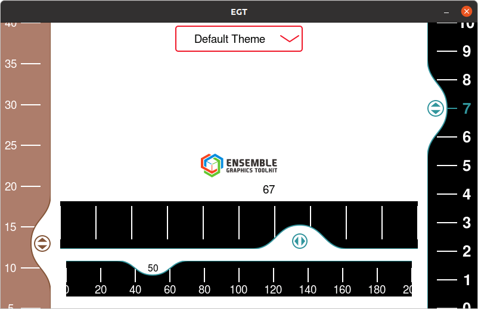

# egt-sliderb

## Description

Slider extension for the Microchip Ensemble Graphics Toolkit

This repository contains an example Widget extension for the Slider control. It implements a slider with an interactive bump as the handle. 

The SliderB (slider with bump) has a number of features:


- Can implement integer and floating point selections.
- Horizontal or vertical orientations. `(Orientation::horizontal | Orientation::vertical)`
- Slider handle can be located on the top or bottom of the slider (for horizontal orientation) or left and right (for vertical orientation). `(enum SliderB::SliderBFlag::bump_top | enum SliderB::SliderBFlag::bump_right )`
- Either plain tick marks or labels can be displayed on the scale. `(sliderB::SliderBFlag::show_labels)`
- Current value can be displayed on the handle instead of the button picture. `(SliderB::SliderBFlag::show_value)`
- Current value can be highlighted in text_highlight color. `(SliderB::SliderBFlag::highlight_value)`

Example application containing four sliders. 
Slider on the left has been configured to use a custom theme. Other sliders have been configured to use a different custom theme.

## EGT version

1.3

## Tests

- PC (Ubuntu)

## Dependencies

- libegt
- libcairo

## Compilation Instructions

````
cmake -S . -B build
cd build
make
````
## Screenshot


